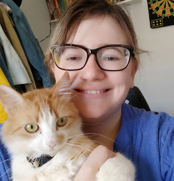

🇺🇸

# Repository Name

> ⚠️ This repository uses the **brasilian portuguese** language in some parts of the code and in some parts of the README. Get in touch if you have any questions.

 

Here we put some description about the repository.

> Reference if needed with link

 

## Table of Content

- [Item 1](#item1)
  - [Subitem 1](#item1-1)
  - [Subitem 2](#item1-2)
  - [Subitem 3](#item1-3)
- [Item 2](#item2)
- [Item 3](#item3)
- [Item 4](#item4)
- [Item 5](#item5)

 

## 🛠️ Used Technology

- [HTML]()
- [CSS]()
- [JavaScript]()

 

<h2 id="item1">Item 1</a>
<h3 id="item1-1">Sub-item 1</a>
<h3 id="item1-2">Sub-item 2</a>
<h3 id="item1-3">Sub-item 3</a>
<h2 id="item2">Item 2</a>
<h2 id="item3">Item 3</a>
<h2 id="item4">Item 4</a>
<h2 id="item5">Item 5</a>

 

## Project Status

### 🚧    Em construção    🚧

</h3>

### To-do List

- [x] Item 1
- [x] Item 2
- [ ] Item 3
- [ ] Item 4

## Dependencies

## How to Run

***

## Author

<b>Isabella de Freitas Nunes</b>  
A girl who loves teaching and learning algorithms, theory of computation and coding.

Entre em contato! 👋

***

🇧🇷

# Nome do repositório

> ⚠️ Este repositório usa o **português brasileiro** em algumas partes do código bem como do README. Entre em contato no caso de qualquer dúvida.

 

Descrição do repositório aqui.

> Referência do assunto do repositório aqui

 

## Índice

- [Item 1](#item1)
  - [Subitem 1](#item1-1)
  - [Subitem 2](#item1-2)
  - [Subitem 3](#item1-3)
- [Item 2](#item2)
- [Item 3](#item3)
- [Item 4](#item4)
- [Item 5](#item5)

 

## 🛠️ Tecnologias usadas

- [HTML]()
- [CSS]()
- [JavaScript]()

 

<h2 id="item1">Item 1</a>
<h3 id="item1-1">Sub-item 1</a>
<h3 id="item1-2">Sub-item 2</a>
<h3 id="item1-3">Sub-item 3</a>
<h2 id="item2">Item 2</a>
<h2 id="item3">Item 3</a>
<h2 id="item4">Item 4</a>
<h2 id="item5">Item 5</a>

 

## Project Status

### 🚧    Em construção    🚧

</h3>

### To-do List

- [x] Item 1
- [x] Item 2
- [ ] Item 3
- [ ] Item 4

## Dependencies

## How to Run

***

## Author

<b>Isabella de Freitas Nunes</b>  
A girl who loves learning about algorithms, theory of computation and coding.

Entre em contato! 👋

