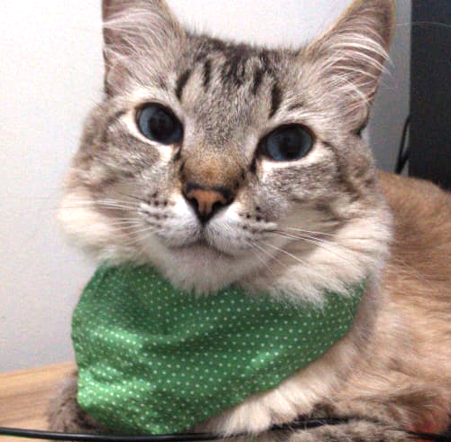

<h1 align="center">
    Julinho's Life
</h1>

    
    
    
    

 

    

 

## Technologies

- Unity3D
- C#

## Project

In this repository are a game colled Julinho's Life developed for a work of Computer Graphics II class of the Bachelor's on Computer Science. The purpose was to make a game which simuletes the life of my cat, he rans arround the backard of my house searching for [Whiskas](https://www.whiskas.com/) and coins (for buying more wet food).

## Run

You need to download Unity3D and run inside of the app.

## License

This project is under the CC BY-SA 4.0. See [LICENSE](/LICENSE.md) file for more details.