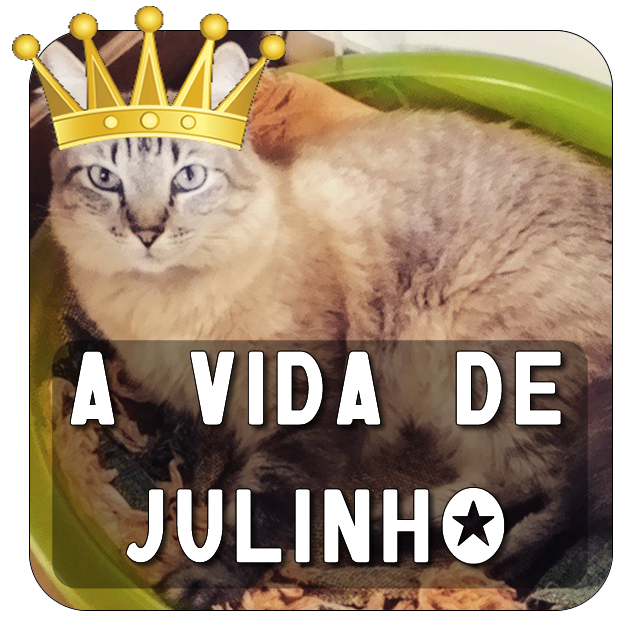

🇺🇸

  

# Julinho's Life

> ⚠️ This repository uses the **brasilian portuguese** language in some parts of the code and and the README. Get in touch if you have any questions.

This is a personal project using Arduino and sensors for monitoring the temperature of my home office and control de hummidity of the plants that lives in my desk (no, they aren't Cactus 🌵).

> Visit if you want to know more about [Arduino](https://www.arduino.cc/)

## Project Status

### 🚧 Under construction 🚧

## To-do List

- [x] Temperature Arduino code
- [x] Humidity Arduino code
- [ ] Adapt board project to wireless support (no serial)
- [ ] REST API
- [ ] React Native Application

***

## Author

<b>Isabella de Freitas Nunes</b>  
A girl who loves teaching and learning algorithms, theory of computation and coding.

Get in touch! 👋

***

🇧🇷

# Monitor de temperatura e umidade do Home office

> ⚠️ Este repositório usa o **português brasileiro** em algumas partes do código e no README. No caso de dúvidas entre em contato.

Este é um projeto pessoal usando Arduino e sensores para monitorar a temperatura do meu home office, assim como verificar a umidade das plantas que moram na minha mesa de trabalho (não, não são cactos 🌵).

> Visite se quiser conhecer mais sobre o [Arduino](https://www.arduino.cc/)

## Status do Projeto

### 🚧 Em construção 🚧

## A fazer

- [x] Código do Arduino para monitorar a temperatura
- [x] Código do Arduino para monitorar a umidade
- [ ] Adaptar o projeto para wireless (dispensar o uso do cabo serial)
- [ ] API REST
- [ ] Aplicação em React Native

***

## Autora

<b>Isabella de Freitas Nunes</b>  
Uma menina que gosta de ensinar e aprender algoritmos, teoria da computação e programação.

Vamos conversar! 👋

